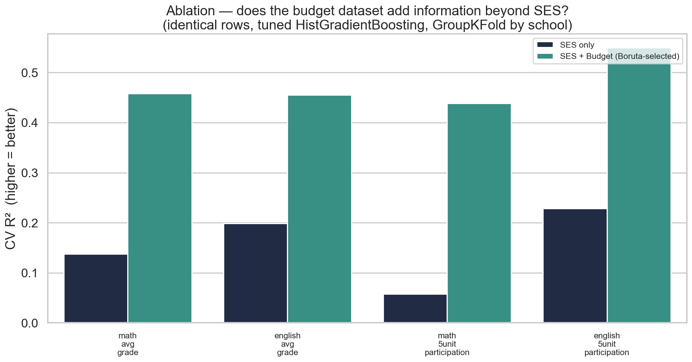
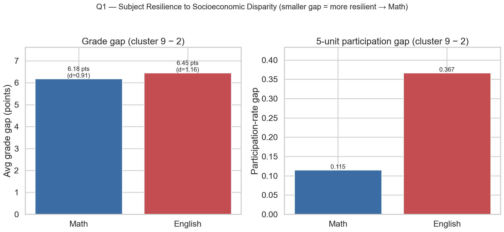
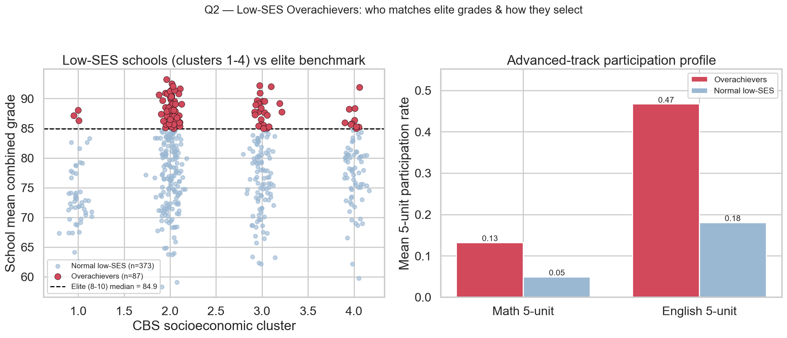
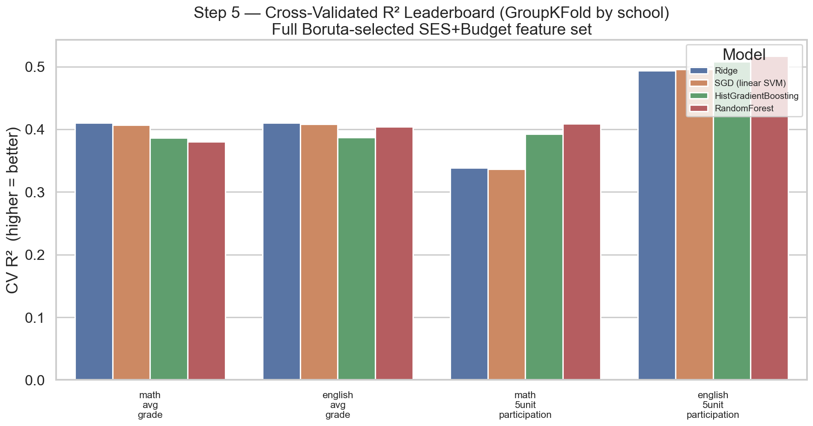
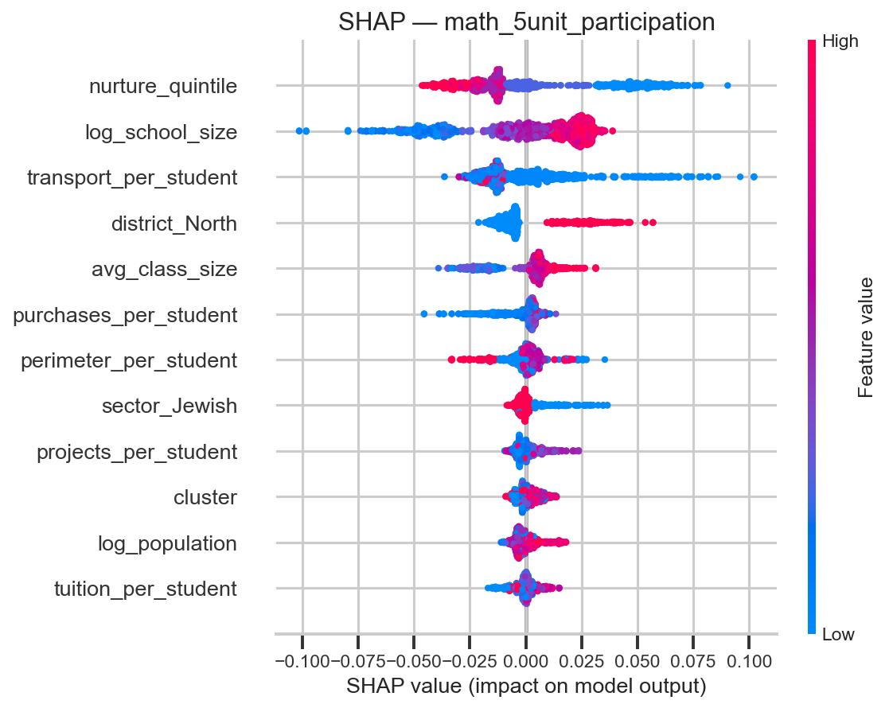

# 📊 Predicting Bagrut Success from Municipal Socioeconomics and School-Level Institutional Resources

> An end-to-end, empirical data-science pipeline testing whether **municipal
> socioeconomic status and school-level institutional resources — together —
> predict Israeli high-school matriculation (Bagrut) outcomes** — from three
> raw Hebrew/administrative data sources to cross-validated, explainable
> machine-learning models.


**Authors:** Yousef Shihade & Shada Essawi · *Data Science Lab — Final Project*

---

## 🎯 Research Questions

1. **Main:** Can municipal socioeconomic status and school-level institutional
   resources, **combined**, meaningfully predict Israeli high-school Bagrut
   achievement and advanced-track participation?
2. **Secondary A:** Which subject — Math or English — is more **resilient** to
   socioeconomic and institutional disparity, and are there schools that
   consistently outperform their peers despite limited resources?
3. **Secondary B:** Which specific school-level factors — budget allocation,
   class size, sector, or supervision type — most strongly predict Bagrut
   outcomes, independent of municipal wealth?

We model four school-level targets: **average Bagrut grade** and **5-unit
(advanced-track) participation rate**, each for **Mathematics** and **English**.

---

## 🏗 Pipeline Architecture

The project is organised as **five isolated, self-contained, sequential
stages**. Each folder owns its own `README.md`, `config.yaml`, `code/`, data,
and graphs, and consumes the previous stage's output.

```
   datasets/  (raw Bagrut .csv + CBS .xlsx + Ministry budget .xlsx — git-ignored)
                 │
                 ▼
┌─────────────────────────────────────────────────────────────────────┐
│ STEP 1 · Ingestion & Standardization — ALL THREE DATASETS             │
│   utf-8-sig BOM · CBS header offset · openpyxl colour-patch for budget │
│   · Hebrew normalisation · single-year budget snapshot documented     │
└─────────────────────────────────────────────────────────────────────┘
                 │   bagrut_clean.csv · ses_clean.csv · budget_clean.csv
                 ▼
┌─────────────────────────────────────────────────────────────────────┐
│ STEP 2 · Three-Way Merge                                              │
│   Join A: Bagrut↔CBS fuzzy name (99.44%) · Join B: Bagrut↔Budget      │
│   exact semel key (99.68%) → one consolidated record-level table      │
└─────────────────────────────────────────────────────────────────────┘
                 │   merged_three_datasets.csv
                 ▼
┌─────────────────────────────────────────────────────────────────────┐
│ STEP 3 · Feature Engineering & Target Setup                           │
│   re-grain to school × year · 4 targets · 8 budget ratios + school-   │
│   level categoricals → candidate feature space 4 → 23                 │
└─────────────────────────────────────────────────────────────────────┘
                 │   school_level_features_targets.csv
                 ▼
┌─────────────────────────────────────────────────────────────────────┐
│ STEP 4 · Preprocessing, Outliers & MICE Robustness                    │
│   MICE × 25 independent trials · Isolation Forest + LOF · 2 questions │
└─────────────────────────────────────────────────────────────────────┘
                 │   cleaned_modeling_ready.csv
                 ▼
┌─────────────────────────────────────────────────────────────────────┐
│ STEP 5 · Modeling, Ablation & Explainability                          │
│   iterative VIF · Boruta (49 candidate cols) · Ridge/SGD/RF/HGB ·      │
│   SES-only vs SES+Budget ablation · SHAP                              │
└─────────────────────────────────────────────────────────────────────┘
```

### Repository layout

```
BagrutProject/
├── README.md  ·  LICENSE  ·  requirements.txt
├── datasets/                                  # raw inputs (git-ignored)
├── step_1_ingestion_standardization/
├── step_2_data_merging_integration/
├── step_3_feature_engineering_target_setup/
├── step_4_preprocessing_outliers_imputation_experiment/
└── step_5_predictive_modeling_explainability/
```

---

## 🧪 Key Experimental Footprints

**MICE robustness experiment (Step 4).** Following feedback that a single
masked-imputation run isn't sufficient evidence, we repeated the "mask 8% and
reconstruct" test **25 times** with independent random seeds:

| Method | R² (mean ± std across 25 runs) | RMSE (mean ± std) |
|---|---|---|
| **MICE (IterativeImputer)** | **0.9536 ± 0.0060** | 0.199 ± 0.016 |
| Median baseline | −0.0046 ± 0.0059 | 0.927 ± 0.037 |

➡️ **MICE beat the median baseline on all 25/25 runs**, with a standard
deviation of just 0.6% of the mean — proof the result is stable, not a lucky
draw.

**Other footprints:** 99.44% Hebrew locality match (Join A) / 99.68% exact
`semel` match (Join B) in Step 2 · Isolation Forest + LOF consensus of 49
outliers (Step 4) · 87/460 (18.9%) low-SES "overachiever" schools identified
(Step 4).

---

## 🏆 Modeling Leaderboard

Final **cross-validated** performance (5-fold **`GroupKFold` grouped by
school** so a school's multiple years never leak across folds). Champion =
**tuned HistGradientBoosting** on the full Boruta-selected SES+Budget feature
set, which won every target.

| 🎯 Target | R² | RMSE | MAE |
|---|--:|--:|--:|
| **english_5unit_participation** | **0.545** | 0.178 | 0.129 |
| `math_avg_grade` | 0.431 | 5.274 | 4.060 |
| `english_avg_grade` | 0.428 | 4.584 | 3.502 |
| `math_5unit_participation` | 0.421 | 0.079 | 0.056 |

> 🥇 Every model family scores **positive R² across the board** on the richer
> v2 feature space (in the earlier SES-only design, RandomForest went
> negative on just 4 features).

---

## 🎯 Ablation Study — Does Institutional Funding Add Information Beyond SES?

For every target we tune HistGradientBoosting **twice on identical rows**:
once on the original SES-only feature set (`cluster`, `log_population`,
`locality_form`, `year`) and once on whatever **Boruta** selected from the
full SES+budget candidate space (49 encoded columns). Same rows, same
GroupKFold folds, same tuning protocol — so the R² delta is attributable
**only** to the extra information.

| 🎯 Target | SES only | **SES + Budget (Boruta-selected)** | **ΔR²** |
|---|--:|--:|--:|
| `math_avg_grade` | 0.138 | **0.458** | **+0.320** |
| `english_avg_grade` | 0.199 | **0.455** | **+0.256** |
| `math_5unit_participation` | 0.058 | **0.439** | **+0.381** |
| `english_5unit_participation` | 0.229 | **0.549** | **+0.321** |

> 📈 **Mean ΔR² = +0.320** — every target's explanatory power **more than
> doubled**. Five budget-derived ratios (tuition, perimeter, projects,
> purchases, and transport per student) are confirmed by Boruta for **every
> single target**, and the Ministry's own **school-level** disadvantage
> ranking (`nurture_quintile`) is, by a wide margin, the **single most
> influential feature in every SHAP ranking** — ahead of the municipal
> cluster every time. Full detail in
> [`step_5_predictive_modeling_explainability/`](step_5_predictive_modeling_explainability/README.md).



---

## 📈 Core Analytical Deliverables

**MICE robustness across 25 independent trials** — a tight, stable advantage
over the median baseline, not a one-off result.


**Subject resilience gap (cluster 2 → 9)** — Math's gap is smaller on both
grade and advanced participation: Math is the more resilient subject.



**Low-SES overachievers** — 18.9% of poor-locality schools match elite grades,
and they funnel markedly more pupils into advanced Math & English tracks.



**Cross-validated model leaderboard** — R² by model across the four targets,
full SES+Budget feature set.



**SHAP explainability** — for the target least explained by SES alone
(`math_5unit_participation`), school-level attributes (`nurture_quintile`,
`log_school_size`, `transport_per_student`) outrank the municipal cluster.



---

## 🎓 Executive Scientific Takeaway

Across three independent methods — **iterative VIF/collinearity analysis**,
**Boruta feature confirmation**, and **SHAP attribution** — the same picture
emerges:

> **Municipal socioeconomic status alone is a weak-to-moderate predictor**
> of Bagrut outcomes (R² 0.06–0.23 in the SES-only arm). **Adding school-level
> institutional resources — budget ratios, class size, sector, supervision,
> district, and above all the Ministry's own school-level disadvantage ranking
> — roughly triples explanatory power** (R² 0.42–0.55). The variance municipal
> SES cannot explain is not noise: a large share of it is **institutional and
> structural school identity**, captured from the start of this pipeline
> rather than as an afterthought.

In short: **school-level circumstances predict Bagrut outcomes better than the
wealth of the town a school sits in** — and that gap is the project's central,
reproducible finding, corroborated by collinearity analysis, feature
selection, and explainability alike.

---

## ⚙️ Reproducing the Pipeline

```bash
# 1. Environment (Anaconda Python 3.11 recommended)
pip install -r requirements.txt

# 2. Place the three raw files in datasets/ (see data sources below)

# 3. Run each stage in order (each is CWD-independent and self-verifying)
python step_1_ingestion_standardization/code/run_step1.py
python step_2_data_merging_integration/code/run_step2.py
python step_3_feature_engineering_target_setup/code/run_step3.py
python step_4_preprocessing_outliers_imputation_experiment/code/run_step4.py
python step_5_predictive_modeling_explainability/code/run_step5.py
```

### 📦 Data sources (raw files are git-ignored, not redistributed)

- **Dataset 1 — Bagrut Grades 2013–2016** (Israeli Freedom of Information Law),
  Kaggle: <https://www.kaggle.com/datasets/emachlev/bagrut-israel/data>
- **Dataset 2 — CBS Socioeconomic Index**: Israel Central Bureau of Statistics,
  <https://www.cbs.gov.il/>
- **Dataset 3 — Ministry of Education School-Budget Report** (per-institution
  budget & enrolment): Israel Ministry of Education info-center,
  <https://infocenter.education.gov.il/all/sense/app/4f021b9e-f3c8-48f0-b349-a29eb97833a9/sheet/013b1d75-d09a-4ad3-9c4e-84085c3cca63/state/analysis>
  — a **single-year (2014/15) snapshot**, joined statically across all Bagrut
  years; see [Step 1's README](step_1_ingestion_standardization/README.md#4-verified-results)
  for the full limitation note.

---

## 🔬 Mandated Methods Coverage

| Category | Method | Stage |
|---|---|---|
| Imputation | **MICE** (IterativeImputer, 25-iteration robustness) | Step 4 |
| Outlier detection | **Isolation Forest**, **Local Outlier Factor** | Step 4 |
| Modeling | **SGD** (linear SVM), Ridge, RandomForest, **HistGradientBoosting** | Step 5 |
| Feature selection | **Boruta** (49-column candidate space) | Step 5 |
| Explainability | **SHAP** | Step 5 |
| Collinearity | **Iterative VIF pruning** | Step 5 |
| Multi-source integration | **3 datasets merged from Step 1** (fuzzy name + exact `semel` joins) | Steps 1–2 |

---

## 🧰 Tech Stack

`Python 3.11` · `pandas` · `numpy` · `scikit-learn` · `statsmodels` · `shap` ·
`Boruta` · `rapidfuzz` · `matplotlib` · `seaborn` — pinned in
[`requirements.txt`](requirements.txt).

## 📄 License

Released under the [MIT License](LICENSE) © 2026 Yousef Shihade & Shada Essawi.
