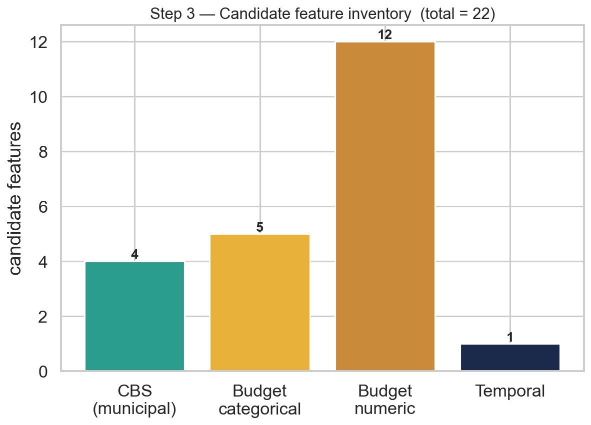
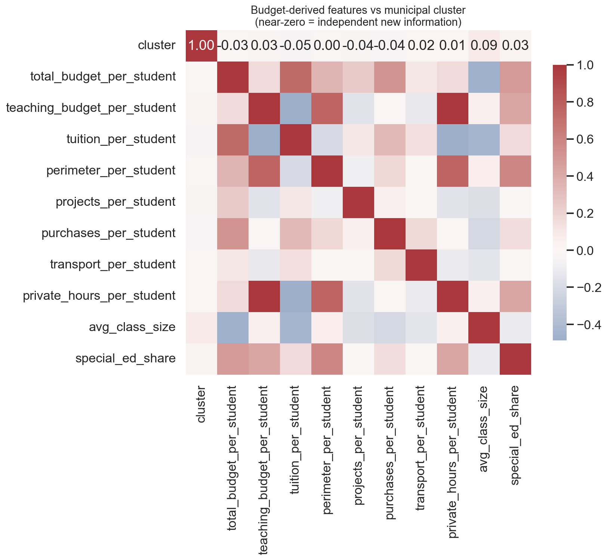

# Step 3 — Feature Engineering & Target Setup (v2)

**Project:** Predicting Bagrut Success from Municipal Socioeconomics and School-Level Institutional Resources
**Authors:** Yousef Shehade & Shada Esawi

> **v2 change.** Targets are still **Math + English only** (as in v1 — see the
> Step 2 discussion for why we kept scope disciplined rather than expanding
> subjects). What's new is the **predictor side**: alongside the municipal CBS
> features, this step engineers **8 per-student budget ratios** and carries **5
> school-level categoricals** — taking the candidate feature count from v1's
> **4 → 23**.

---

## 1. Directory structure

```
step_3_feature_engineering_target_setup/
├── README.md
├── config.yaml                # grain, subject defs, feature/ratio definitions
├── code/
│   ├── io_load.py
│   ├── feature_engineering.py # _aggregate_subject (v1, unchanged) + NEW ratio engineering
│   ├── visualize.py           # 4 plots
│   └── run_step3.py           # orchestrator + verification summary
├── data/
│   └── school_level_features_targets.csv   # 3,731 × 45
└── graphs/
```

Run: `python code/run_step3.py`.

---

## 2. What's reused vs. what's new

| Component | Status |
|---|---|
| `_aggregate_subject()` (targets) | **unchanged from v1** — dataset-agnostic, already validated |
| Math + English filter, units 3/4/5 for grade, 5-unit for participation | **unchanged from v1** |
| Grain = `semel × year` | **unchanged from v1** |
| CBS municipal features (`cluster`, `index_value`, `population`, `locality_form`) | **unchanged from v1** |
| **8 engineered budget ratios** (per-student) | **NEW** |
| **5 school-level categoricals** (district, sector, supervision, legal_status, education_stage) | **NEW** |
| `nurture_quintile`, `avg_class_size`, `special_ed_share`, `log_school_size` | **NEW** |
| `log_population` | moved here from v1's Step 4 (a deterministic transform belongs in feature engineering, not preprocessing) |

---

## 3. The 4 targets — unchanged, verified identical to v1

| Target | Non-null | Mean |
|---|--:|--:|
| `math_avg_grade` | 3,292 (88.2%) | 78.68 |
| `english_avg_grade` | 3,280 (87.9%) | 80.81 |
| `math_5unit_participation` | 3,668 (98.3%) | 0.087 |
| `english_5unit_participation` | 3,688 (98.8%) | 0.325 |

Identical row count (**3,731 school-years, 1,022 schools**) and identical target
statistics to v1 — confirming the ported aggregation logic behaves correctly on
the new three-way-merged input.

---

## 4. The new feature space (23 conceptual candidates, up from v1's 4)



| Group | Features | Count |
|---|---|--:|
| CBS municipal | `cluster`, `index_value`†, `population`→`log_population`, `locality_form` | 4 |
| Budget categorical | `district`, `sector`, `supervision`, `legal_status`, `education_stage` | 5 |
| Budget direct numeric | `nurture_quintile`, `avg_class_size` | 2 |
| **Budget engineered ratios** | `total_budget_per_student`, `teaching_budget_per_student`, `tuition_per_student`, `perimeter_per_student`, `projects_per_student`, `purchases_per_student`, `transport_per_student`, `private_hours_per_student` | 8 |
| Budget derived | `special_ed_share`, `log_school_size` | 2 |
| Temporal | `year` | 1 |
| **Total** | | **23** |

† `index_value` is carried through for the VIF demonstration in Step 5, then
dropped (collinear with `cluster`, as established in v1).

All 8 ratios use the guard pattern proven in v1's Step 6: `numerator/denominator`
with `students_regular ≤ 0` and `±inf` forced to `NaN` (never silently propagated).
Coverage: **98.4%** across every ratio (3,672/3,731 school-years).

---

## 5. ⚠️ Data-quality note — `transport_per_student` can be negative

`תקציב הסעות` (transport budget) is **negative for ~86% of institutions** in the
raw Ministry file (min −₪33,722; median per-student **−₪7.15**). This is not a
bug: it is almost certainly a **net budget adjustment/correction** figure rather
than gross transport spending. We kept the column **as-is** — the sign may still
carry real signal — but flag it here so it is never mis-read as a plain cost.

---

## 6. Budget ratios are independent of municipal cluster (verified)



Every engineered budget ratio correlates **near-zero with `cluster`** (all
|r| ≤ 0.09). This **replicates v1's key finding** (`budget_per_student` had
r ≈ 0.03 with cluster) across the *entire* new ratio set — confirming these are
genuinely new, independent information rather than a disguised proxy for
municipal wealth. (Contrast with `index_value`, r ≈ 0.97 with cluster —
redundant, and dropped in Step 5.)

Note: this is about the **numeric ratios**. Step 2 already showed the
**categorical** `sector` *is* associated with cluster (Arab/Bedouin/Druze schools
concentrate in low clusters) — so categoricals and ratios behave differently and
both deserve attention in Step 5's collinearity analysis.

---

## 7. Plots (`graphs/`)

| File | Shows |
|---|---|
| `target_distributions.png` | histograms of all 4 targets |
| `cluster_vs_targets.png` | Math/English avg grade by cluster (SES gradient) |
| `feature_inventory.png` | candidate feature count by source (4 → 23) |
| `budget_ratio_correlation.png` | budget ratios × cluster correlation heatmap |

---

## 8. Step 3 verification checklist

- [x] Filtered to Math + English only (24.4% of subject-cells); units 3/4/5 for
      grade, 5-unit for participation — unchanged from v1.
- [x] Re-grained to `semel × year`: 3,731 rows, 1,022 schools — identical to v1.
- [x] Targets never imputed; identical statistics to v1 (aggregation validated).
- [x] 8 budget ratios engineered with robust div-by-zero/inf guards; 98.4% coverage.
- [x] 5 school-level categoricals + `nurture_quintile` + `avg_class_size` carried forward.
- [x] `transport_per_student` sign anomaly investigated and documented, not hidden.
- [x] Budget ratios confirmed near-orthogonal to cluster (|r| ≤ 0.09) — genuine
      new information, replicating v1's key finding across the full ratio set.
- [x] 4/4 plots saved.
- [x] `school_level_features_targets.csv` (3,731 × 45) written.

**Status: Step 3 complete ✔**
