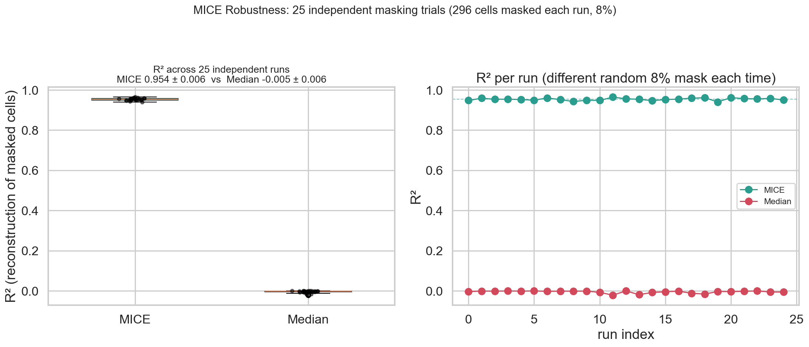
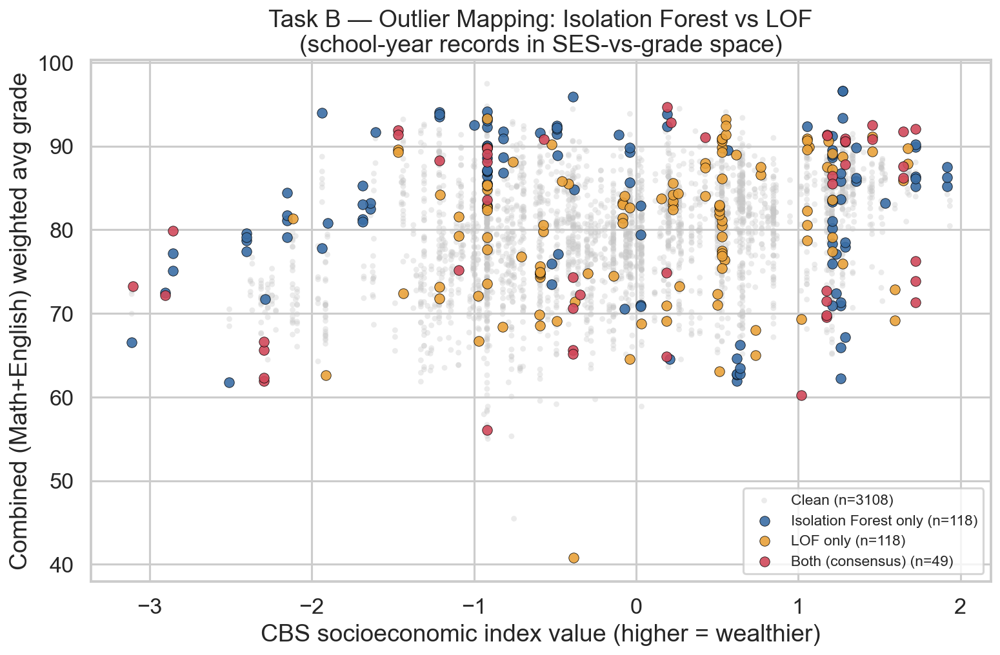

# Step 4 — Preprocessing, Outliers & MICE Robustness (v2)

**Project:** Predicting Bagrut Success from Municipal Socioeconomics and School-Level Institutional Resources
**Authors:** Yousef Shehade & Shada Esawi

> **v2 change.** The lecturer flagged that a *single* masked-imputation run is
> not sufficient evidence of stability. Task A now repeats the MICE experiment
> **25 times** with independent random seeds/masks and reports the full
> distribution (mean ± std, min/max) rather than one number. Tasks B and C reuse
> v1's proven methodology, now operating on the richer v2 feature space.

---

## 1. Directory structure

```
step_4_preprocessing_outliers_imputation_experiment/
├── README.md
├── config.yaml                    # 25 iterations, outlier feature space, exploratory params
├── code/
│   ├── io_load.py                 # load Step-3 table + combined_avg_grade, log_total_takers
│   ├── imputation_experiment.py   # NEW: 25-iteration MICE robustness
│   ├── outliers.py                # Isolation Forest + LOF (v1, unchanged)
│   ├── exploratory.py             # Q1 resilience + Q2 overachievers (v1, unchanged)
│   └── run_step4.py               # orchestrator + verification summary
├── data/
│   ├── cleaned_modeling_ready.csv     # 3,731 × 54 (targets, features, outlier flags)
│   └── mice_robustness_runs.csv       # per-run detail, all 25 trials
└── graphs/
```

Run: `python code/run_step4.py`.

---

## 2. Task A — MICE robustness (v2: 25 independent trials)

**Why 25 runs, not 1.** One masked draw could be lucky or unlucky. Repeating with
25 different random seeds (same 8% mask fraction, same predictor set, same
`IterativeImputer` config each time) shows whether the result is a stable
property of the method or a fluke of one draw.

**Setup:** mask `index_value` (100% complete CBS feature) on **296 rows** (8% of
3,697) per run; reconstruct with MICE (`IterativeImputer` + `BayesianRidge`) and a
median baseline; score both against the true hidden values. Predictor set
**expanded to 14 columns** (v1 had 9) — now includes the budget-derived features,
so the demonstration reflects the actual v2 dataset.

### Results across 25 runs

| Method | R² (mean ± std) | R² range | RMSE (mean ± std) |
|---|---|---|---|
| **MICE** | **0.9536 ± 0.0060** | 0.9405 – 0.9645 | 0.199 ± 0.016 |
| Median baseline | −0.0046 ± 0.0059 | ≈ 0 throughout | 0.927 ± 0.037 |

**MICE outperformed the median baseline on all 25/25 runs.**



The left panel's tight boxplot (std = 0.006, about 0.6% of the mean) and the right
panel's flat, non-drifting line across runs are the direct visual proof of
stability the lecturer asked for.

---

## 3. Task B — Outlier detection (unchanged method, richer feature space)

Same two complementary detectors as v1 — **Isolation Forest** (global anomalies)
and **Local Outlier Factor** (local-density anomalies) — now run on a **9-feature
space** (v1 used 7), adding `total_budget_per_student` and `avg_class_size` so
institutional-resourcing outliers can be caught too.

| | Isolation Forest | LOF | Consensus (both) |
|---|--:|--:|--:|
| Flagged | 167 | 167 | **49** |

Jaccard overlap = **0.172** (v1: 0.116) — still low, confirming the two detectors
capture different anomaly notions, but the richer feature space raised agreement
somewhat. As in v1, only the **49 consensus** records are flagged
(`outlier_consensus`) — none are deleted from the data; they are simply
**excluded from model training** in Step 5 via a config switch, so they remain
fully auditable.



---

## 4. Task C — Exploratory questions (unchanged from v1)

Both questions are **SES-only by design** (they test the original research
question's resilience/overachiever findings) and depend only on `cluster` and the
4 targets — unaffected by the new budget features, so results are **identical to
v1**, confirming the aggregation pipeline carried through correctly.

**Q1 — Subject resilience** (cluster 2 → cluster 9 gap): **Math is more
resilient** — grade gap 6.18 pts (d=0.91) vs English 6.45 pts (d=1.16);
participation gap 0.115 (Math) vs 0.367 (English).

**Q2 — Low-SES overachievers**: **87 / 460 (18.9%)** of low-cluster (1–4) schools
match or exceed the elite-cluster (8–10) median grade (84.90); their advanced-track
participation is significantly higher (Math p=1.4e-05, English p=1.4e-11).

---

## 5. Step 4 verification checklist

- [x] MICE robustness run **25×** with independent seeds; MICE beats median on 25/25 runs.
- [x] MICE predictor set expanded to 14 columns (incl. budget features).
- [x] Per-run detail saved (`mice_robustness_runs.csv`) for full auditability.
- [x] Isolation Forest + LOF run on the expanded 9-feature space; 49 consensus outliers flagged (not deleted).
- [x] Exploratory Q1/Q2 reproduce v1 exactly — sanity-checks the pipeline port.
- [x] 4/4 plots saved.
- [x] `cleaned_modeling_ready.csv` (3,731 × 54) written.

**Status: Step 4 complete ✔**
