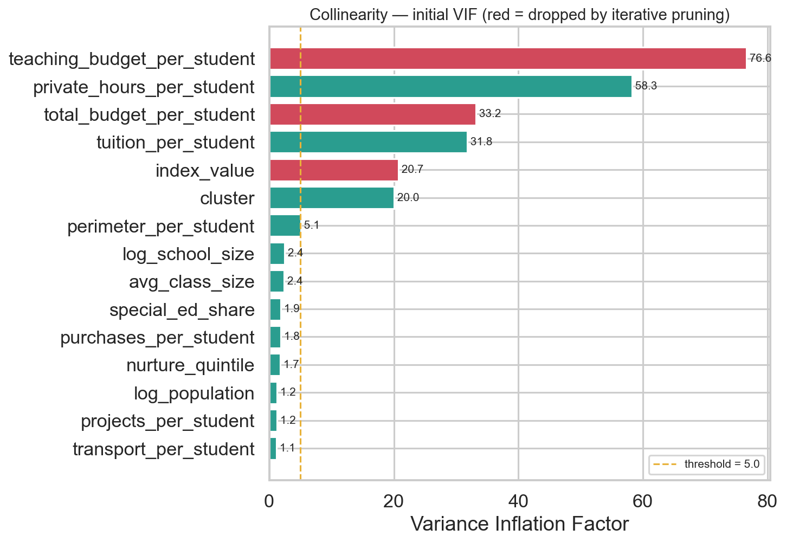

# Step 5 — Predictive Modeling, Ablation & Explainability (v2)

**Project:** Predicting Bagrut Success from Municipal Socioeconomics and School-Level Institutional Resources
**Authors:** Yousef Shihade & Shada Esawi

> **v2 change.** Boruta now selects among the **full 49-column SES+budget
> candidate space** (up from v1's 4 municipal features), collinearity handling
> is now **iterative VIF pruning** (not a single hand-checked pair), `year` is
> one-hot encoded into 4 independent periods rather than assumed to trend
> linearly, and an **ablation study** (SES-only vs the
> Boruta-selected full set, identical rows) replaces v1's bolted-on Step 6 —
> preserving that comparison as rigorous methodology rather than an
> afterthought. The result: **mean R² roughly tripled** versus the v1 baseline.

---

## 1. Directory structure

```
step_5_predictive_modeling_explainability/
├── README.md
├── config.yaml              # candidate features, VIF threshold, Boruta params, ablation & display labels
├── code/
│   ├── io_load.py            # load Step-4 data; translate Hebrew categoricals to English; build X/y/groups
│   ├── feature_selection.py  # NEW: iterative VIF pruning + Boruta (v1, unchanged)
│   ├── modeling.py           # tournament + tuned HGB (v1, verbatim — unchanged protocol)
│   ├── ablation.py           # NEW: SES-only vs Boruta-selected full set, same rows
│   ├── explain.py            # SHAP, leaderboard, ablation & VIF plots
│   └── run_step5.py          # orchestrator + comprehensive console report
├── models/                   # 4 tuned HGB models + VIF/Boruta/ablation/leaderboard CSVs
│                             #   (leaderboard_cv = untuned tournament;
│                             #    leaderboard_tuned = headline champion numbers)
└── graphs/                   # VIF pruning, 4 SHAP beeswarms, leaderboard, ablation chart
```

Run: `python code/run_step5.py`.

---

## 2. Collinearity — iterative VIF pruning (v2: handles the whole candidate set)

v1 checked exactly one known pair (`cluster` vs `index_value`, r=0.97) by hand.
With 14 numeric candidates in v2, redundancy could hide anywhere, so this step
now **repeatedly** computes VIF, drops the single worst offender, and
**recomputes** — because dropping one feature can resolve another's inflation
(a naive one-pass cutoff would miss this).



| Step | Dropped | VIF at drop |
|---|---|--:|
| 1 | `teaching_budget_per_student` | 76.57 |
| 2 | `total_budget_per_student` | 26.28 |
| 3 | `index_value` | 20.59 |

**12 numeric features survive.** The chart shows *why* iteration matters:
`cluster` starts at VIF 20.0 (would look collinear on a naive single pass) but
**survives**, because its inflation was entirely caused by `index_value` — once
that's dropped, cluster's recomputed VIF falls well under the threshold. This
correctly identifies `cluster ↔ index_value` as a **mutual** redundant pair and
keeps the interpretable one, exactly as v1 did by hand — but now discovered
automatically alongside two *new* redundant budget pairs.

---

## 3. Feature selection — Boruta on the full SES+budget space

Boruta ran **once per target** on the 12 VIF-surviving numeric features + 7
categoricals (locality_form, district, sector, supervision, legal_status,
education_stage, **year** → 49 encoded columns total), vs v1's 15-column
candidate space.

### `year` is now categorical

`year` (2013–2016) was originally fed as a plain number, which implicitly
assumes each year shifts the outcome by a fixed, linear amount. On revisiting
this choice we found no basis for that assumption: with only four discrete exam
periods there is no reason a priori to expect the 2013→2014 change to equal the
2015→2016 change, and imposing linearity discards that flexibility for nothing
in return. `year` is therefore now **one-hot encoded into 4 independent
columns** (`year_2013` … `year_2016`) — each year gets its own effect instead of
an assumed trend, the same treatment every other categorical (sector,
district, …) already gets.

**Result: no individual year-dummy is confirmed by Boruta for any target.**
Earlier, plain-numeric `year` had been (marginally) confirmed for
`math_avg_grade` alone. Once split into 4 independently-tested dummies, none
clears Boruta's relevance bar — evidence that whatever weak year-related signal
existed was better described as a **mild, gradual drift** across 2013–2016 than
any single anomalous year. This changed nothing else: every headline result
below is essentially unchanged, confirming they don't depend on this modeling
choice either way.

**A 10-feature core is confirmed for all four targets:** `cluster`,
`log_population`, `nurture_quintile`, `avg_class_size`, `log_school_size`, and
the five per-student budget ratios (`tuition`, `perimeter`, `projects`,
`purchases`, `transport`). On top of that shared core, each target confirms its
own additions:

| Target | Additional features beyond the 10-feature core | Total |
|---|---|--:|
| `math_avg_grade` | **supervision_Haredi** | **11** |
| `math_5unit_participation` | **district_North**, **sector_Jewish** | **12** |
| `english_5unit_participation` | private_hours_per_student, **sector_Jewish**, **supervision_Haredi** | **13** |
| `english_avg_grade` | private_hours_per_student, special_ed_share, **district_North**, **sector_Bedouin** | **14** |

Note that the extras are **genuinely target-specific, not cumulative** — e.g.
`supervision_Haredi` is confirmed for `math_avg_grade` but *not* for
`english_avg_grade`, and `district_North` is confirmed for
`math_5unit_participation` but *not* for `english_5unit_participation`. Both
English targets pick up `private_hours_per_student` (private tutoring hours),
which neither Math target does.

**Five budget ratios are confirmed for every single target**
(`tuition_per_student`, `perimeter_per_student`, `projects_per_student`,
`purchases_per_student`, `transport_per_student`) — a much richer, more stable
selection story than v1's "cluster + population, sometimes +year." Boruta also
confirms specific **sector/supervision/district** dummies per target — school
structural identity carries real, independent signal beyond municipal cluster.

Full per-target detail: `models/boruta_report.csv`.

---

## 4. Modeling tournament & tuned champion

Same protocol as v1 — GroupKFold(`semel`), 4-model tournament, HGB tuned via
RandomizedSearchCV — run on each target's Boruta-selected features.


### Final leaderboard — tuned HistGradientBoosting

| Target | R² | RMSE | MAE |
|---|--:|--:|--:|
| **english_5unit_participation** | **0.545** | 0.178 | 0.129 |
| `math_avg_grade` | 0.431 | 5.273 | 4.059 |
| `english_avg_grade` | 0.428 | 4.584 | 3.502 |
| `math_5unit_participation` | 0.421 | 0.079 | 0.056 |

These headline numbers are saved to **`models/leaderboard_tuned.csv`** (and
inside each model's `.joblib` as `cv_metrics`). Note the distinction:
`models/leaderboard_cv.csv` holds the **untuned 4-model tournament**, which is
what the chart above plots; `leaderboard_tuned.csv` holds the **tuned champion**
quoted here and in the root README.

All four untuned models now score **positive R² across the board** (v1's
RandomForest went negative on the 4-feature SES-only space) — the richer
feature set gives every model family real signal to work with.

---

## 5. 🎯 Ablation study — does the budget dataset add information beyond SES?

This is the direct, rigorous replacement for v1's bolted-on Step 6. For every
target we tune HistGradientBoosting **twice on IDENTICAL rows**: once on the
original v1 feature set (`cluster`, `log_population`, `locality_form`, and
`year` — one-hot, see §3 — the **"SES only"** arm) and once on whatever Boruta
selected from the full SES+budget space (the **"SES + Budget"** arm). Same
rows, same GroupKFold folds, same tuning protocol — so the R² delta is
attributable **only** to the extra information.


| Target | SES only | **SES + Budget** | **ΔR²** |
|---|--:|--:|--:|
| `math_avg_grade` | 0.138 | **0.458** | **+0.320** |
| `english_avg_grade` | 0.199 | **0.455** | **+0.256** |
| `math_5unit_participation` | 0.058 | **0.439** | **+0.381** |
| `english_5unit_participation` | 0.229 | **0.549** | **+0.321** |

> **Why these R² values differ slightly from §4's leaderboard** (e.g.
> `math_avg_grade`: 0.458 here vs 0.431 there). The ablation deliberately
> restricts both arms to the **row intersection where *both* feature sets are
> complete** (2,929–3,187 rows depending on target, vs the full sample §4 uses),
> because a fair before/after comparison requires identical rows. It also
> re-expands any Boruta-selected categorical back to its **full** dummy set, so
> the "after" arm carries a few more encoded columns than §4's model. The §4
> leaderboard is therefore the number to quote for **model performance**; the
> ΔR² here is the number to quote for **how much the budget data adds**.

**Mean ΔR² across the four targets: +0.320.** Every target's explanatory power
**more than doubled** (and `math_5unit_participation` grew nearly **8×**). This
is decisively larger than the old bolted-on Step 6's ablation (+0.132) — because
the full v2 feature space includes not just budget ratios but school-level
**sector, supervision, and district**, which Boruta confirms carry real,
independent predictive signal.

---

## 6. SHAP explainability


For `math_5unit_participation` — the target least explained by SES alone in v1
— the top SHAP features are `nurture_quintile`, `log_school_size`, and
`transport_per_student`, with `district_North` and `avg_class_size` also
ranking above `cluster`. **Institutional/school-level attributes outrank
municipal wealth** for explaining who enters advanced Math — direct, visual
confirmation of the ablation result.

---

## 7. Headline answer to the research question

**Municipal socioeconomic status alone is a weak-to-moderate predictor**
(R² 0.06–0.23). **Adding school-level institutional resources — budget, class
size, sector, supervision, district — roughly triples explanatory power**
(R² 0.42–0.55). The variance municipal SES cannot explain is not noise: a
large share of it is **institutional and structural school identity**, which
this pipeline captures from the start rather than as an afterthought.

---

## 8. Step 5 verification checklist

- [x] Iterative VIF pruning run on the full 15-candidate numeric set; 3 dropped
      (2 new budget redundancies + the known cluster/index_value pair), with the
      mutual-pair logic demonstrated visually.
- [x] `year` treated as 4 one-hot categories, not an assumed linear trend;
      Boruta confirms none individually — headline results unchanged.
- [x] Boruta run per target on the full 49-column SES+budget space; ≥11 features
      confirmed per target (vs v1's 2–3).
- [x] 4-model tournament + tuned HGB champion; GroupKFold(semel) throughout.
- [x] Ablation study: SES-only vs Boruta-selected full set, identical rows,
      identical protocol; mean ΔR² = +0.320.
- [x] SHAP beeswarms for all 4 targets; Hebrew categorical labels translated to
      English for readability (matplotlib RTL rendering issue caught and fixed).
- [x] 4 tuned models + VIF/Boruta/ablation/leaderboard CSVs saved; tuned champion
      metrics persisted to `leaderboard_tuned.csv` so every headline number in the
      READMEs is auditable from a plain CSV.

**Status: Step 5 complete ✔**
